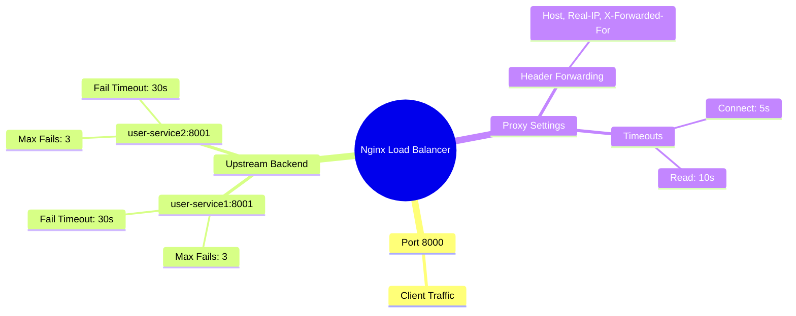

# Nginx Docker Load Balancer

A high-performance load balancing setup using Nginx in Docker, routing traffic across multiple backend Node/service instances with built-in passive health checks.

## Architecture Diagram

